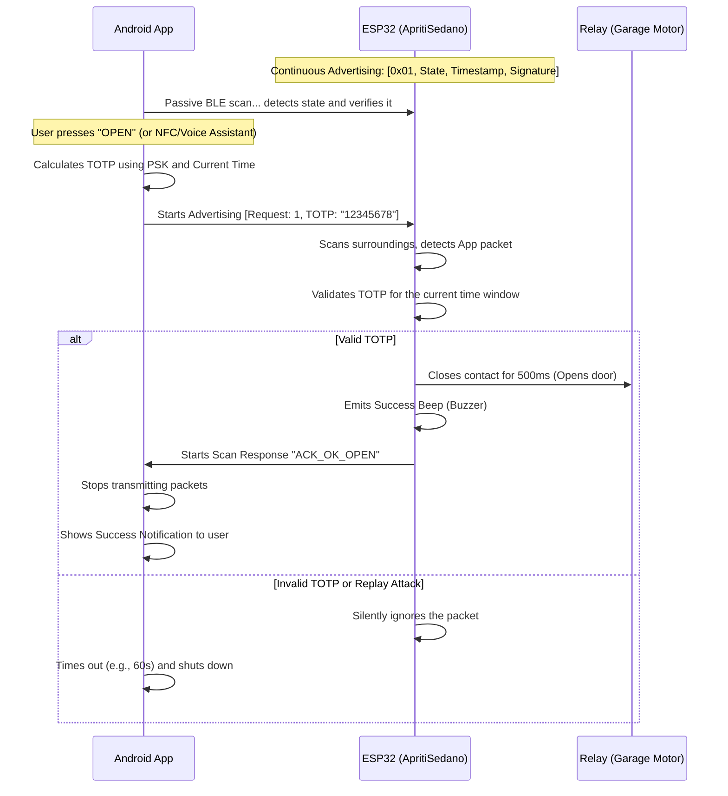
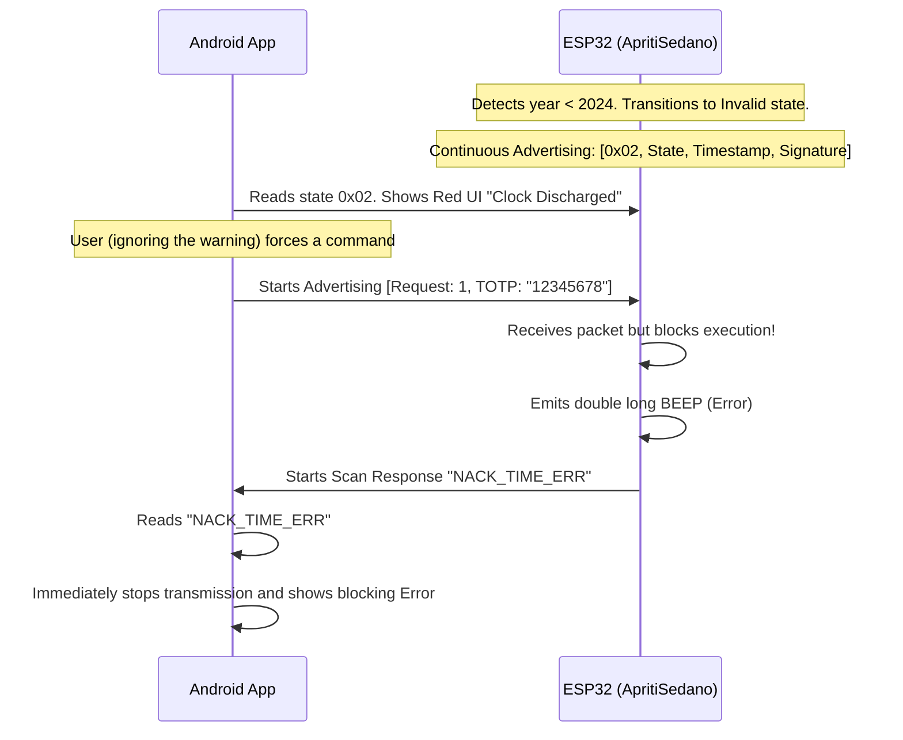
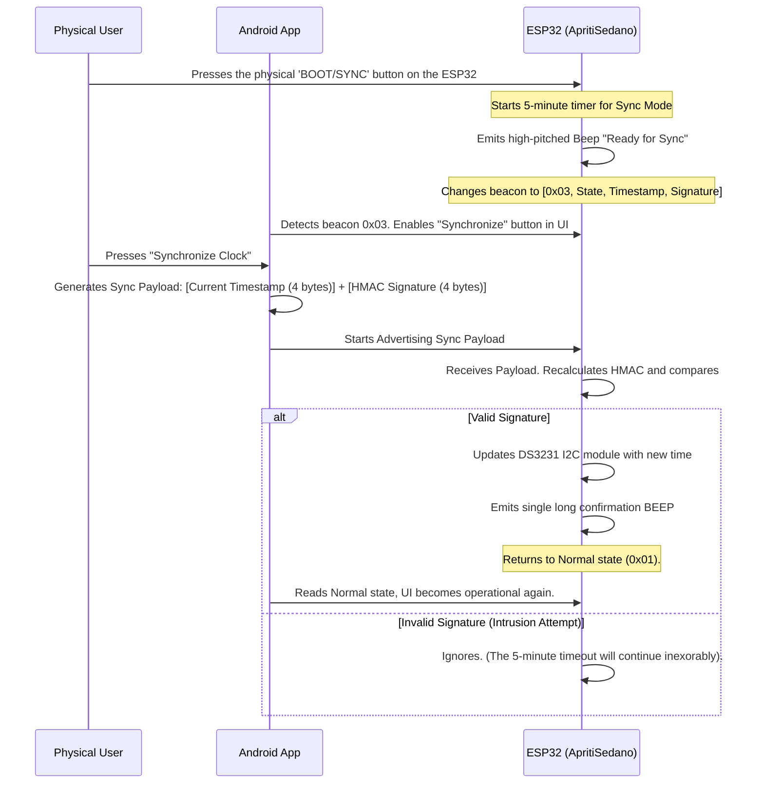

# BLE Communication Protocol (ApritiSedano / ApritiSedano)

The ApritiSedano system utilizes the Bluetooth Low Energy (BLE) protocol to ensure 100% secure operations in offline mode. No Wi-Fi or Internet connection is required. To minimize energy consumption and avoid pairing issues, **all communication takes place via Advertising and Scanning (Connectionless Mode)**.

---

## 1. BLE Packet Architecture

Both the microcontroller (MCU) and the Android App communicate by sending messages within the **Manufacturer Specific Data** field of BLE packets. The manufacturer ID used is fixed: `0x02E5`.

### A. State Beacon (From MCU to App)
The MCU periodically broadcasts its state. The App listens to these beacons to understand the current state of the box and whether there are any anomalies.

**Payload Structure (Hexadecimal):**
`[0x01 | 0x02 | 0x03] [Door State] [Timestamp (4 bytes)] [HMAC Signature (4 bytes)]`

- **Byte 0 (Beacon Type):**
  - `0x01`: Normal (Clock synchronized, ready to operate).
  - `0x02`: Synchronization Error (RTC discharged/invalid).
  - `0x03`: Sync Mode (Physical button pressed, waiting to receive the time from the app).
- **Byte 1 (Door State):**
  - `0x00`: Closed
  - `0x01`: Open
- **Byte 2-5 (Timestamp):** The 4 least significant bytes of the current UNIX time (used to prevent state replay).
- **Byte 6-9 (Signature):** The first 4 bytes of the HMAC-SHA1 calculated on the state and timestamp, to prevent an attacker from forging a false state.

### B. Command Payload (From App to MCU)
To send a command, the App starts advertising a structured packet.

**Payload Structure:**
`[Requested State (1 byte)] [TOTP Token (8-character ASCII string)]`

- **Requested State:** `0` (Close) or `1` (Open).
- **TOTP:** Generated by combining the pre-shared secret key (PSK) and the current UNIX time (in 30-second windows).

### C. ACK/NACK Responses (From MCU to App)
After receiving and processing a command from the app, the ESP32 responds by temporarily modifying its BLE *Scan Response* and inserting a text string.

- `"ACK_OK_OPEN"`: Valid command, box opening.
- `"ACK_OK_CLOSED"`: Valid command, box closing.
- `"NACK_TIME_ERR"`: Command rejected due to time desynchronization (Invalid RTC).

---

## 2. Normal Operation Flow (Opening / Closing)

In this scenario, the ESP32 clock is correct and the system is in the normal state (`0x01`).

---

## 3. Error Flow (RTC Backup Battery Dead)

If the CR2032 backup battery of the RTC module discharges and power is lost, the ESP32 will boot with a UNIX epoch time (e.g., year 1970). 
In this state of cryptographic vulnerability, the device categorically **refuses** to accept any operational command.

---

## 4. Recovery and Synchronization Flow (Sync Mode)

When the ESP32 is blocked (State `0x02`), the only way to restore service is a secure manual synchronization. The user must physically go to the control unit and press a hardware button to activate "Sync Mode".

